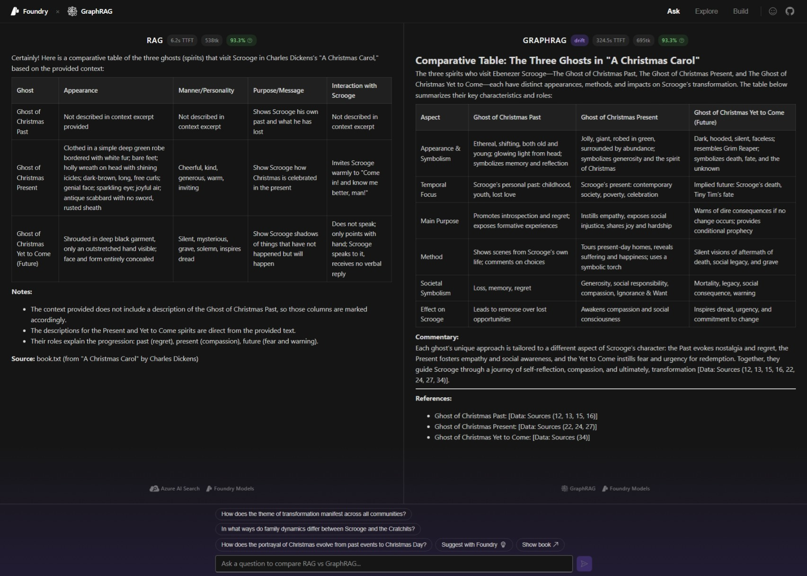

# GraphRAG Interactive Demo

An interactive way to learn how GraphRAG works, built for the Microsoft Foundry booth at AI Tour Brussels 2026. Compare GraphRAG and vanilla RAG answers side by side to see where knowledge graphs shine, explore a 3D visualization of the graph database behind GraphRAG, and build a mini knowledge graph yourself to understand the full pipeline end to end — all powered by Microsoft Foundry.

## Demos

_Hover over link to reveal a demo video_

- **Ask**: [Comparing RAG with GraphRAG](https://github.com/aryxenv/graphrag-ai-tour-26/issues/22)
- **Explore**: [Explore the graph database used for GraphRAG in 3D](https://github.com/aryxenv/graphrag-ai-tour-26/issues/23)
- **Build**: [Build your own GraphRAG from scratch](https://github.com/aryxenv/graphrag-ai-tour-26/issues/24)

## Preview



## What It Does

The app has three tabs:

- **Ask**: Submit a question and see GraphRAG and vanilla RAG answer side by side. Pre-generated questions highlight where GraphRAG excels: multi-hop reasoning, cross-document synthesis, and global summarization. ([demo video](https://github.com/aryxenv/graphrag-ai-tour-26/issues/22))
- **Explore**: Browse a 3D force-directed visualization of a pre-built knowledge graph. Click any node to inspect entities and relationships extracted by GraphRAG. ([demo video](https://github.com/aryxenv/graphrag-ai-tour-26/issues/23))
- **Build**: Walk through the full pipeline end to end. Pick a scenario, generate synthetic corporate memos with a Foundry agent, run GraphRAG indexing, and then query the resulting graph. ([demo video](https://github.com/aryxenv/graphrag-ai-tour-26/issues/24))

## Architecture

- **Frontend**: React 19 + Fluent UI v9 + Vite. Graph visualization with `react-force-graph-3d` / Three.js. Streamed responses rendered with `react-markdown`.
- **Server**: FastAPI (Python). Serves query endpoints for both RAG and GraphRAG with SSE streaming. Includes AI-powered response evaluation via Azure AI Evaluation SDK.
- **RAG Pipeline**: Azure AI Search hybrid (text + vector) retrieval with GPT-4.1 answer generation.
- **GraphRAG Pipeline**: Knowledge graph extraction, community detection, and multi-engine search (local / global / drift) powered by the `graphrag` library.
- **Models**: Azure OpenAI GPT-4.1 and text-embedding-3-large.

## Project Structure

```
client/          React + Vite frontend
server/          FastAPI backend (query, evaluation, question generation)
rag/             Vanilla RAG indexing pipeline (Azure AI Search)
graphrag/        GraphRAG indexing config, prompts, cached outputs, and source data
BUILD.md         Detailed technical build notes and endpoint mapping
```

## Getting Started

### Quick Start — Azure Developer CLI (recommended)

The fastest way to get up and running. A single command provisions all Azure resources and deploys the app:

```bash
azd auth login
azd up
```

This will provision AI Services (with model deployments), AI Search, Storage, Container Registry, and Container Apps — then build, push, and deploy both the client and server. No manual resource creation or `.env` files required.

See [azure/README.md](azure/README.md) for prerequisites, architecture details, redeployment commands, and troubleshooting.

---

### Manual Setup (local development)

### Prerequisites

- Node.js 20+
- Python 3.11+ and [uv](https://docs.astral.sh/uv/)
- An Azure subscription with the resources listed below
- Azure CLI installed and logged in (`az login`)

### Azure Resources

Deploy the following resources in your Azure subscription. Authentication uses `DefaultAzureCredential` throughout — no API keys required (assign your user the appropriate RBAC roles on each resource).

| Resource                            | What it provides                                              | Manual Configuration                                    |
| ----------------------------------- | ------------------------------------------------------------- | ------------------------------------------------------- |
| **Azure AI Foundry** (Azure OpenAI) | LLM completions and embeddings                                | Deploy `gpt-4.1`, `text-embedding-3-large` (3 072 dims) |
| **Azure AI Search**                 | Hybrid (text + vector) retrieval for the vanilla RAG pipeline | —                                                       |
| **Azure Blob Storage**              | Stores user feedback submitted from the app                   | Create a container named `feedback`                     |

> The Foundry resource exposes two endpoint flavours — an **OpenAI** endpoint (`*.openai.azure.com`) for chat completions and a **Cognitive Services** endpoint (`*.cognitiveservices.azure.com`) for embeddings. Both come from the same resource.

### Environment Variables

Every subfolder (`server/`, `graphrag/`, `rag/`, `eval/`) has its own `.env.example`. Copy each one to `.env` and fill in the URLs from the resources above — the same URLs are reused across folders:

| Variable                            | Example value                                             | Used by                                                    |
| ----------------------------------- | --------------------------------------------------------- | ---------------------------------------------------------- |
| `AZURE_OPENAI_ENDPOINT`             | `https://<foundry-resource>.openai.azure.com/`            | server, graphrag, rag, eval                                |
| `AZURE_COGNITIVE_SERVICES_ENDPOINT` | `https://<foundry-resource>.cognitiveservices.azure.com/` | server, graphrag, rag, eval                                |
| `AZURE_AI_SEARCH_ENDPOINT`          | `https://<search-resource>.search.windows.net`            | server, rag                                                |
| `AZURE_BLOB_STORAGE_ENDPOINT`       | `https://<storage-account>.blob.core.windows.net/`        | server                                                     |
| `GRAPHRAG_API_KEY`                  | `<API_KEY>`                                               | server, graphrag (leave as-is when using managed identity) |

### RAG Indexing

See [rag/README.md](rag/README.md) for the Azure AI Search indexing setup.

### Frontend

```bash
cd client
npm install
npm run dev
```

### Server

```bash
cd server
uv venv
uv pip install -r requirements.txt
uv run python src/index.py
```

### GraphRAG Indexing

> [!NOTE]
> This is pre-indexed, no need to run this again.

Configure your Azure OpenAI connection in `graphrag/settings.yaml`, then run the indexing pipeline. See [graphrag/README.md](graphrag/README.md) for details.

### Evaluation

The app evaluates responses using the Azure AI Evaluation SDK with five metrics: relevance, coherence, groundedness, similarity, and retrieval.

- **Ask tab** — two-phase evaluation:
  - **Quick** (per-pipeline): Relevance + Coherence → runs as soon as a response finishes streaming.
  - **Full** (both pipelines): Groundedness + Similarity + Retrieval → runs once both RAG and GraphRAG complete, using GraphRAG as the ground truth.
- **Build tab** — single-pass evaluation: all five metrics run together after each query.

Scores appear as badges next to each response. See [eval/README.md](eval/README.md) for batch eval scripts and dataset details.

## Additional Details

- [azure/README.md](azure/README.md): Azure Container Apps deployment with `azd up`
- [graphrag/README.md](graphrag/README.md): GraphRAG pipeline, configuration, and search modes
- [rag/README.md](rag/README.md): Vanilla RAG pipeline and Azure AI Search setup
- [eval/README.md](eval/README.md): Evaluation pipeline, evaluators, and phased scoring
- [BUILD.md](BUILD.md): Technical breakdown including tab behavior, API endpoints, and stack details

_This documentation was generated with the help of AI_
